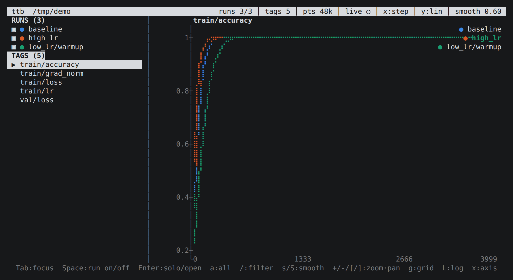
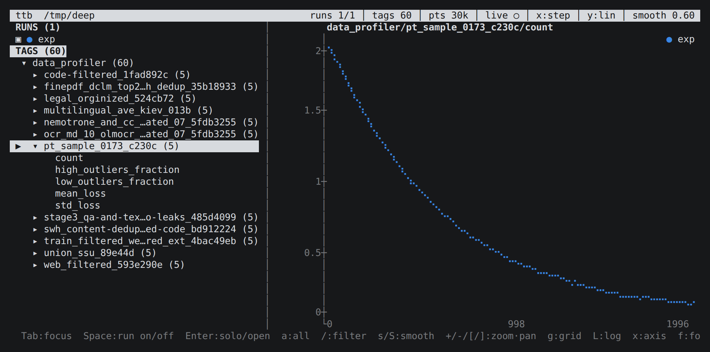
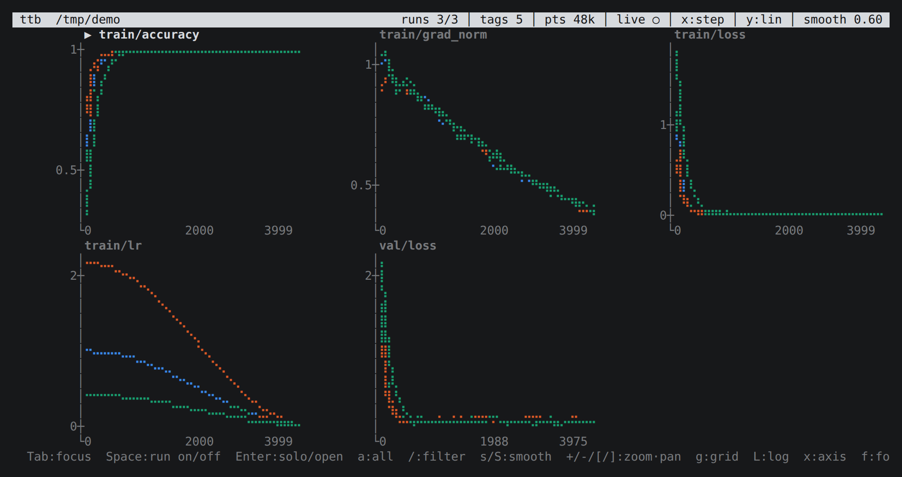
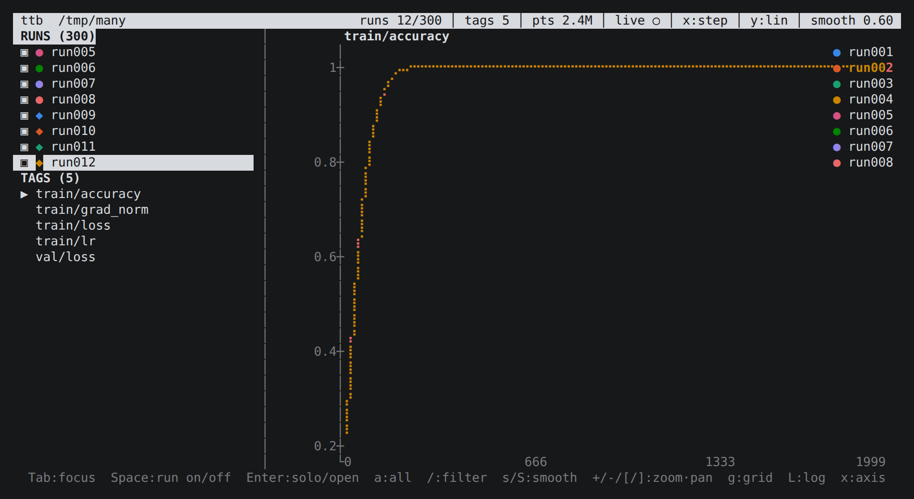

# terminal-tensorboard

[](https://github.com/IvanLukianenko/terminal-tensorboard/actions/workflows/ci.yml)

An ultra-fast terminal UI for viewing TensorBoard training logs, written in
Rust. Point it at your log directory and watch your losses live — over SSH,
in tmux, anywhere you have a terminal. No TensorFlow, no protobuf, no
browser, no Python.



*Three runs overlaid on one tag, the sidebar listing runs and tags, the legend
naming each curve. Every screenshot here is real output, captured from a
running `ttb`.*

## Speed

Measured on 50 MB of logs — 3 runs × 5 tags × 80 000 steps, **970 000
scalar points** (`ttb bench LOGDIR`, warm page cache):

| | Rust | Python (v0.1) | speedup |
| --- | --- | --- | --- |
| Cold load, 970k points | **84 ms** (11.5M pts/s) | 3 027 ms (0.32M pts/s) | **36×** |
| Live refresh tick | **90 µs** | 250 µs | 2.8× |
| Render prep, 80k pts → 400 columns | **156 µs** | 850 µs | 5.4× |

At 156 µs of frame preparation, redraws are bounded by the terminal, not by
the data — panning and zooming through a million points is instant.

### Why it's fast

- **Zero-copy tfevents parser.** A hand-rolled TFRecord + protobuf-wire-format
  reader walks the mapped bytes and hands out `&[u8]` tag slices — no
  protobuf crate, no allocation per point, no intermediate message structs.
  Field keys are matched as whole bytes (`0x15` = `simple_value`) so the
  common path is a single jump table, and non-scalar payloads (images,
  histograms) are skipped without being decoded.
- **Incremental tailing.** Each file is read once; every refresh parses only
  the bytes appended since the last one. Partially-written trailing records
  are handled correctly and re-read once complete.
- **Compact columnar storage.** Points live in flat `Vec<i64>` / `Vec<f64>`
  columns — 24 bytes per point, cache-friendly for the bucketing scan.
- **Pixel-bucket rendering.** Before drawing, each series is reduced to one
  mean value per braille pixel column: a binary search for the visible range,
  then a single linear pass, so the per-frame cost depends on terminal width
  rather than on run length.
- **Background loading, one file at a time.** A loader thread lists the files
  that have unread bytes (the only step needing the store), then reads and
  parses each one with the store unlocked, taking the lock only to append the
  finished columns. The interface is up in single-digit milliseconds and the
  charts fill in as runs arrive, however long the whole load takes: on 300
  runs × 20 000 steps (24M points, ~5 s to read in full) the run list appears
  at 8 ms and the first curves at 160 ms.
- **Release profile** with fat LTO and a single codegen unit.

## Install

### Download a binary

Every [release](https://github.com/IvanLukianenko/terminal-tensorboard/releases)
carries a prebuilt binary. One file, no runtime, nothing else to install.

| Platform | Archive |
| --- | --- |
| Linux x86-64 | `ttb-0.3.0-x86_64-unknown-linux-musl.tar.gz` — static, runs on any distribution |
| Linux arm64 | `ttb-0.3.0-aarch64-unknown-linux-gnu.tar.gz` |
| macOS Apple silicon | `ttb-0.3.0-aarch64-apple-darwin.tar.gz` |
| macOS Intel | `ttb-0.3.0-x86_64-apple-darwin.tar.gz` |
| Windows x86-64 | `ttb-0.3.0-x86_64-pc-windows-msvc.zip` |

Linux and macOS — take the row that matches your machine and put the binary on
your `PATH`:

```bash
REL=https://github.com/IvanLukianenko/terminal-tensorboard/releases/download/v0.3.0
PKG=ttb-0.3.0-x86_64-unknown-linux-musl          # or another row from the table

curl -fsSL -O "$REL/$PKG.tar.gz"
tar xzf "$PKG.tar.gz"
sudo install -m755 "$PKG/ttb" /usr/local/bin/    # or: mv "$PKG/ttb" ~/.local/bin/
ttb ~/runs
```

Windows, in PowerShell:

```powershell
$pkg = "ttb-0.3.0-x86_64-pc-windows-msvc"
Invoke-WebRequest "https://github.com/IvanLukianenko/terminal-tensorboard/releases/download/v0.3.0/$pkg.zip" -OutFile "$pkg.zip"
Expand-Archive "$pkg.zip" -DestinationPath .
.\$pkg\ttb.exe C:\runs
```

To check what you downloaded, `SHA256SUMS` is published beside the archives:

```bash
curl -fsSL -O "$REL/SHA256SUMS"
sha256sum -c SHA256SUMS --ignore-missing     # macOS: shasum -a 256 -c
```

The binaries are unsigned. macOS quarantines anything fetched through a
browser, so if you downloaded that way rather than with `curl`, clear the flag
once: `xattr -d com.apple.quarantine ttb`.

### Install with cargo

```bash
cargo install --git https://github.com/IvanLukianenko/terminal-tensorboard   # no checkout
cargo install --path .                                                       # from a checkout
```

### Build from source

```bash
git clone https://github.com/IvanLukianenko/terminal-tensorboard
cd terminal-tensorboard
cargo run --release -- ~/runs
```

Rust 1.75+ and nothing else: the only dependencies are crossterm and ratatui,
both pure Rust, so there is no C toolchain, no protobuf compiler and no Python
in the build.

### Releasing

`.github/workflows/release.yml` builds every target in the table, attaches the
archives and their checksums to a GitHub release, and writes the notes from the
commit log. Either of these starts it:

```bash
git tag v0.3.0 && git push origin v0.3.0   # the tag publishes itself
git push origin release/v0.3.0             # the workflow creates the tag
```

The branch form is there so a release can be cut without holding tag-push
rights locally. Running the workflow by hand from the Actions tab builds the
same archives without releasing anything — they land as artifacts on that run.

## Usage

```bash
ttb LOGDIR                  # scan LOGDIR recursively, follow for new data
ttb LOGDIR --no-follow      # one-shot view
ttb LOGDIR --refresh 0.5    # poll twice a second
ttb LOGDIR --smoothing 0.9  # heavier EMA smoothing
ttb LOGDIR --x reltime      # x axis: step | reltime | wall
ttb LOGDIR --max-runs 20    # show 20 runs by default (0 = every run)
ttb LOGDIR --max-points 5000 # keep 5000 points per run+tag (0 = keep all)
ttb bench LOGDIR            # time a cold load, a refresh tick and a frame
```

Every subdirectory containing `tfevents` files becomes a run, exactly like
TensorBoard. Both classic `simple_value` scalars and TF2 tensor-encoded
scalars are understood, whether written by TensorFlow, PyTorch's
`SummaryWriter`, or anything else that speaks the format.

## Keys

| Key | Action |
| --- | --- |
| `Tab` / `Shift-Tab` | cycle focus: runs → tags → chart |
| `j` `k` / arrows | move in lists; prev/next tag when chart is focused |
| `Space` | show/hide the selected run |
| `Enter` | on a run: show only it (solo) · on a tag group: open/close · on a tag: chart it |
| `→` `←` (or `l` `h` in the tag list) | open / close a tag group |
| `a` | show/hide every run the filter currently lists |
| `/` | filter the focused list — runs or tags (Enter apply, Esc cancel) |
| `h` `l` / arrows | move the data cursor over the chart (`c`/Esc clears) |
| `+` `-` | zoom in / out (centred on the cursor) |
| `[` `]` | pan left / right, `0` resets the view |
| `s` / `S` | less / more smoothing (TensorBoard-style debiased EMA) |
| `L` | toggle log-scale Y |
| `x` | cycle X axis: step → relative time → wall clock |
| `g` | grid view: as many charts as fit the pane, up to 3 × 3 |
| `f` | toggle live follow, `r` reload now |
| `b` | toggle the sidebar |
| `?` | help, `q` quit |

## Tag groups

Tags are paths — `data_profiler/swh_content-dedup-opc-filtered_bd912224/mean_loss`
— and a real run logs dozens of them under the same prefix. Listed flat, every
row repeats that prefix and the part that tells them apart runs off the edge of
the sidebar. So the list is a tree, split on `/`:



Sixty tags become thirteen rows, eighteen with one group open. Groups count what they hold, `→`/`←` open and
close them, and `←` on a tag steps back out to its group. The top level starts
open and deeper levels closed; a filter opens everything, so a match is never
hidden inside a closed group. Selecting a group charts the first tag in it, so
moving through the tree always shows something.

Two more things keep names readable. A chain of groups with one child each is
folded into a single row (`val/loss`, not `val` then `loss`) — depth costs
indent, and indent is width the names need. And when a name still does not fit,
it is cut in the **middle**: `swh_content-dedup…-code_bd912224` keeps the hash
at the end, which is usually the part that distinguishes one group from
another. The sidebar itself grows to fit the longest name it has to show, up to
two fifths of the pane, and stays narrow when the names are short.

## The grid view

`g` fills the pane with as many charts as fit at a legible size — up to three
columns and three rows, arranged to leave no empty cells:



## Try it without a training run

A demo-log generator is built into the binary:

```bash
ttb gen-demo demo_logs                 # 3 runs, 5 tags, 5k steps
ttb gen-demo demo_logs --steps 80000   # ~1M points
ttb gen-demo demo_logs --live          # keeps appending, for live-follow
ttb demo_logs
```

## Many runs

A log directory with hundreds of runs loads fine, but putting all of them on
one chart is unreadable, so **only the first 8 runs are shown by default** —
the rest are loaded and listed, just switched off. A one-line notice on
startup says how many were found. `--max-runs N` changes the number;
`--max-runs 0` shows every run.

Picking runs from the sidebar (`Shift-Tab` focuses the RUNS list):

- `Space` shows or hides the run under the cursor.
- `Enter` solos it — only that run stays on the chart.
- `/` filters the run list by name; the filter is a plain case-insensitive
  substring.
- `a` shows or hides **everything the filter lists**, so `/lr_` then `a`
  switches on exactly that group and leaves the rest alone.

The default only ever applies to a run the first time it is seen, so a run
appearing mid-training never overrides a choice you have already made.



*300 runs with `--max-runs 12`. Runs 9 to 12 carry a `◆` marker: their hues
repeat the first eight, so their curves are drawn dashed to keep them apart.*

Loading is progressive: runs and tags are listed as soon as the directory is
walked, and the points stream in behind them, so a large directory is usable
long before it has finished reading.

## Memory and thinning

A stored point costs 24 bytes (step, wall-clock, value), so a series is
bounded by `--max-points` — **100 000 per run+tag by default**, which is far
more than a terminal can resolve: a 400-column chart still averages 250
points per column, and zooming 100× still leaves a thousand. `--max-points 0`
keeps every point.

Past the cap a series is **thinned to an even subsample**, never averaged or
interpolated — every point drawn is a point that was logged. The stride
doubles each time the cap is reached (the header then reads `pts 970k ÷128`),
and it is keyed to a running count of points *offered* rather than to the
stored length, so the sample stays even from the first step to the last: a
run tailed live in 20-point appends keeps exactly the same points as the same
run loaded cold in one pass.

Thinning happens while parsing, not afterwards, and files are read in 4 MiB
slices, so neither a series nor the read buffer has to hold a whole large
file. Measured on 3 runs × 5 tags × 80 000 steps (970k points, 50 MB):

| `--max-points` | stored | thinning | peak RSS |
| --- | --- | --- | --- |
| 0 (keep all) | 969 600 | ÷1 | 40 MB |
| 10 000 | 129 600 | ÷8 | 19 MB |
| 1 000 | 9 900 | ÷128 | 15 MB |

The cap is per series, so total memory scales with the number of runs and
tags as well: hiding a run takes it off the chart, not out of memory.

## Run colors

Each run is drawn in its own color, from a fixed order of eight hues — blue,
orange, aqua, yellow, magenta, green, violet, red — validated for
colorblind separation and for contrast against the terminal background
(CVD ΔE ≥ 8 on adjacent pairs, all eight ≥ 3:1 contrast).

- **A run keeps its color.** The slot is assigned once, when the run is first
  discovered, and never recomputed — so switching a run off, or a new run
  appearing mid-training, never repaints the others.
- **Past eight runs the hues repeat, but the stroke changes**: runs 9–16 are
  drawn dashed, 17+ dotted, and their legend marker changes with them
  (`●` → `◆` → `▪`). Two runs never share both a hue and a stroke, so the
  chart itself stays readable without cross-checking the legend.
- **The palette follows the terminal.** Truecolor terminals get the exact
  hues; 256-color terminals get them snapped to the nearest xterm index that
  still clears the lightness and chroma gates; anything else falls back to the
  basic ANSI eight in the same order. Detection is from `COLORTERM`/`TERM`.

Every run's name sits beside its color in the sidebar and in the chart
legend, so identity is never carried by color alone.

## Notes

- Smoothing is applied to the per-column bucket means (each already the mean
  of the raw points in that column), which matches TensorBoard's look while
  staying O(width) per frame.
- Corrupt or truncated event files never crash the viewer — parsing stops at
  the first bad record and keeps everything before it.
- Record CRCs are not verified on read. Framing plus protobuf structure is
  validation enough here, and skipping the checksum is a large part of the
  read speed; CRCs *are* written correctly by `gen-demo`.

## Development

```bash
cargo test        # 33 unit tests: parser, store, thinning, plotting, colors, run selection
cargo clippy      # clean
```

Layout: `src/tfevents.rs` (parser/writer) · `src/store.rs` (run discovery,
incremental ingest) · `src/plot.rs` (braille canvas, bucketing, smoothing) ·
`src/colors.rs` (categorical palette, line styles) · `src/app.rs` (state, key
handling) · `src/ui.rs` (rendering) · `src/gen.rs` (demo logs) ·
`src/main.rs` (CLI, loader thread, event loop).

### Python version

The original dependency-free Python implementation lives in
[`python/`](python/) and is kept as a reference and a fallback for
environments without a Rust toolchain:

```bash
python -m terminal_tensorboard ~/runs     # from python/
python -m unittest discover -s tests      # 11 tests
```

It is feature-equivalent but roughly 36× slower to load and no longer the
recommended way to run this tool.
